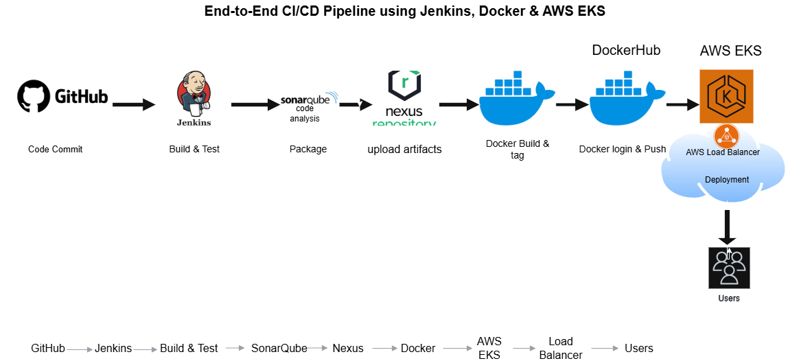

# 🚀 CI/CD Pipeline for Python App Deployment on AWS EKS

## 📌 Project Overview

This project demonstrates a complete **CI/CD pipeline** for deploying a Python application to an AWS EKS cluster using industry-standard DevOps tools.

The pipeline automates:

* Code build & testing
* Code quality analysis
* Artifact management
* Containerization
* Deployment to Kubernetes (EKS)

---

## 🏗️ Architecture Flow

```
GitHub → Jenkins → Build & Test → SonarQube → Nexus → Docker → DockerHub → AWS EKS → LoadBalancer → Users
```
## Architecture Diagram


---

## 🛠️ Tech Stack

* **Version Control**: GitHub
* **CI/CD Tool**: Jenkins
* **Build Tool**: Python (pip, pytest)
* **Code Quality**: SonarQube
* **Artifact Repository**: Nexus
* **Containerization**: Docker
* **Container Registry**: DockerHub
* **Orchestration**: Kubernetes (AWS EKS)
* **Cloud Provider**: AWS

---

## 🔄 CI/CD Pipeline Flow

### 1️⃣ Code Commit

* Developer pushes code to GitHub repository

### 2️⃣ Jenkins Pipeline Trigger

* Jenkins pulls code from GitHub

### 3️⃣ Build & Test

* Install dependencies
* Run unit tests

### 4️⃣ Code Quality Analysis

* SonarQube scans code
* Ensures quality gate passes

### 5️⃣ Package & Store Artifact

* Application packaged (e.g., `.tar.gz`)
* Stored in Nexus repository

### 6️⃣ Docker Build

* Docker image is built from application

### 7️⃣ Docker Push

* Image pushed to DockerHub

### 8️⃣ Deploy to AWS EKS

* Kubernetes deployment updated with new image
* Pods created in EKS cluster

### 9️⃣ Expose Application

* Service type: LoadBalancer
* External IP assigned
* Application accessible via browser

---

## 📂 Project Structure

```
project/
│
├── app.py
├── requirements.txt
├── Dockerfile
├── Jenkinsfile
├── k8s/
│   ├── deployment.yaml
│   └── service.yaml
└── README.md
├── screenshots/
    ├── README.md
```

---

## ⚙️ Jenkins Pipeline Stages

* Checkout Code
* Build & Test
* SonarQube Analysis
* Package Artifact
* Upload to Nexus
* Docker Build
* Docker Login
* Docker Push
* Update K8s Image
* Deploy to EKS

---

## ☸️ Kubernetes Deployment

### Deployment

* Manages application pods
* Uses Docker image from DockerHub

### Service

* Type: LoadBalancer
* Exposes app externally

---

## 📸 Screenshots of projects            

👉 Detailed screenshots available here:
➡️ screenshots/README.md

Includes:

1. Jenkins Pipeline Success
2. SonarQube Dashboard
3. Nexus Artifact
4. DockerHub Image
5. EKS Cluster Nodes (Ready)
6. Kubernetes Pods Running
7. LoadBalancer External IP
8. Application Running in Browser

---

## 🚀 How to Run

### Step 1: Clone Repo

```
git clone <your-repo-url>
cd project
```

### Step 2: Configure Jenkins

* Add GitHub repo
* Configure credentials:

  * AWS
  * DockerHub
  * SonarQube

### Step 3: Setup AWS CLI & kubeconfig

```
aws configure
aws eks --region <region> update-kubeconfig --name <cluster-name>
```

### Step 4: Run Pipeline

* Click **Build Now** in Jenkins

---

## 🌐 Access Application

```
kubectl get svc
```

* Copy **EXTERNAL-IP**
* Open in browser

---

## ⚠️ Challenges Faced

* Node NotReady issue in EKS
* Jenkins permission issues
* kubeconfig setup for Jenkins user
  

---

## ✅ Outcome

* Fully automated CI/CD pipeline
* Application successfully deployed on AWS EKS
* Accessible via LoadBalancer

---

## 📈 Future Improvements

* Add Helm charts
* Implement auto-scaling
* Add monitoring (Prometheus & Grafana)
* Use AWS ECR instead of DockerHub

---

## 🙌 Author

**Akshay**
DevOps Engineer (Fresher Project)

---
